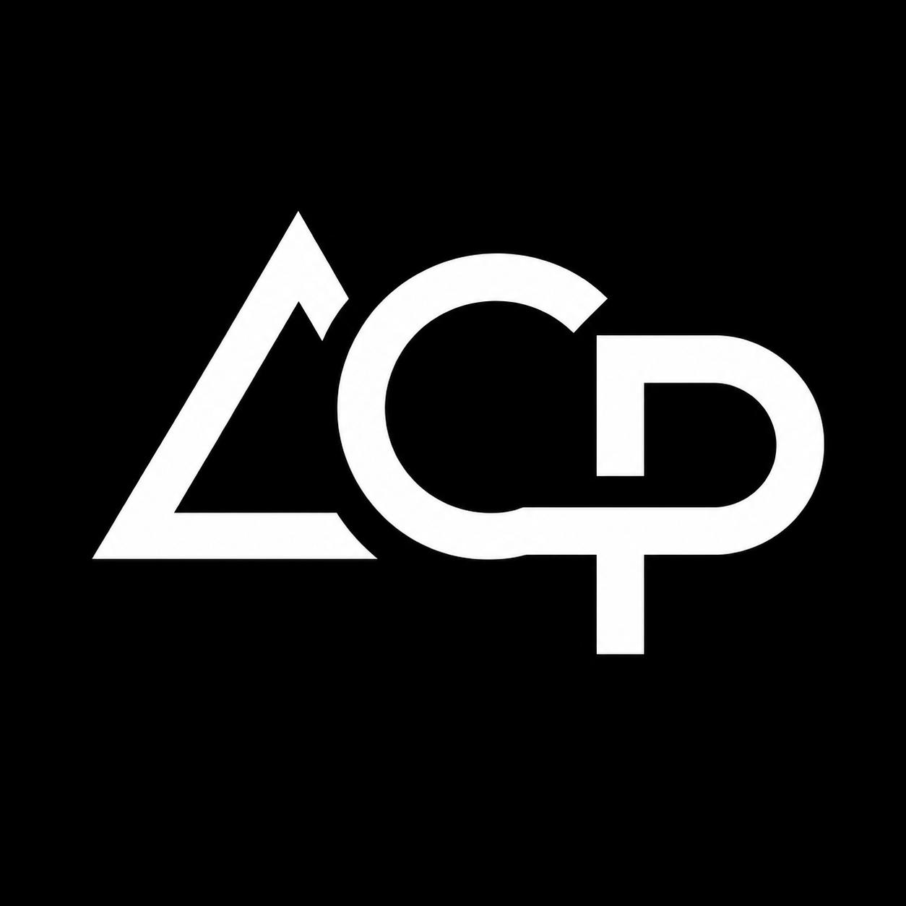

<div align="center">



# PT. ACP Business Support

### Strategic Solutions for Sustainable Business Growth

Professional management consulting, business legalization, corporate administration, and digital business support services for modern businesses in Indonesia.

[](https://acpbusiness-support.my.id/)
[](https://acpbusiness-support.my.id/)
[](#technology-stack)

</div>

---

## Overview

**PT. ACP Business Support** is a professional business support company focused on helping entrepreneurs, professionals, and growing companies build stronger business foundations through legal, administrative, management, and digital support services.

This repository contains the official website source code for **PT. ACP Business Support**, including the main company profile page, bilingual article pages, responsive UI components, SEO structure, sitemap, robots configuration, and supporting digital assets.

---

## Live Website

Website: **https://acpbusiness-support.my.id/**

---

## Core Services

### 1. Management Consulting

Professional business consulting and management support for operational efficiency, business planning, administrative readiness, and structured business development.

### 2. Business Legalization & Licensing

Support for business legalization and licensing needs, including:

- Perseroan Perorangan establishment
- PT establishment support
- AHU administration
- OSS RBA assistance
- NIB registration
- KBLI selection and adjustment
- NPWP Badan and Coretax administration
- Licensing and compliance document preparation

### 3. Corporate Administration Support

Administrative support for companies and business owners, including:

- Corporate documentation
- Document archiving
- Administrative database setup
- Official correspondence support
- Business reporting assistance
- Operational document organization

### 4. Digital Support & Branding

Digital business support for stronger online presence and professional branding, including:

- Company profile development
- Business proposal design
- Landing page development
- Portfolio website development
- Digital branding support
- Social media business setup

### 5. Website & Landing Page Development

Modern and responsive website development using HTML, CSS, and JavaScript, focused on clean design, professional structure, and business credibility.

---

## Website Features

- Fully responsive one-page corporate website
- Bilingual content system: **Bahasa Indonesia / English**
- Dark mode and light mode toggle
- Clean professional UI with **Manrope** and **Inter** font system
- SEO-friendly meta tags and Open Graph configuration
- JSON-LD structured data for business and article pages
- Portfolio filter system
- Article & Insights section
- Dedicated standalone article pages
- Founder profile section
- FAQ accordion
- WhatsApp lead form integration
- Floating WhatsApp button
- Back-to-top button
- Elfsight Google Reviews widget
- Sitemap and robots.txt support

---

## Article Pages

This website includes three professional article pages designed for SEO, business education, and service credibility:

| No | Article Title | File |
|---:|---|---|
| 1 | Syarat Pendirian Perseroan Perorangan untuk UMK | `article-perseroan-perorangan.html` |
| 2 | Perbedaan PT Perorangan dan PT Biasa | `article-pt-perorangan-vs-pt-biasa.html` |
| 3 | Apa Itu KBLI dan Bagaimana Memilih KBLI yang Tepat | `article-kbli-oss-rba.html` |

---

## Technology Stack

### Frontend

- HTML5
- CSS3
- JavaScript
- Responsive Web Design
- SEO Meta Tags
- JSON-LD Structured Data

### UI / UX

- Manrope font for headings and titles
- Inter font for body text and content
- Dark / light mode interface
- Mobile-first responsive layout
- Clean corporate design system

### Tools & Platform

- Visual Studio Code
- GitHub
- Vercel
- Google Search Console
- Elfsight Google Reviews
- OSS RBA
- Coretax DJP
- Canva
- AI-assisted workflow

---

## Repository Structure

```bash
acpbusiness-support/
│
├── index.html
├── article-perseroan-perorangan.html
├── article-pt-perorangan-vs-pt-biasa.html
├── article-kbli-oss-rba.html
│
├── favicon.png
├── favicon-black.png
├── preview-acp.png
├── founder-alfin.png
│
├── robots.txt
├── sitemap.xml
├── google1540e29009921dc9.html
├── README.md
│
└── assets/
    └── img/
        ├── portfolio-legalitas.jpg
        ├── portfolio-company-profile.png
        ├── portfolio-proposal.png
        ├── portfolio-website.png
        ├── portfolio-administration.jpg
        ├── portfolio-digital-documentation.jpg
        ├── article-perseroan-perorangan.jpg
        ├── article-pt-perorangan-vs-pt-biasa.jpg
        └── article-kbli-oss-rba.jpg
```

---

## SEO Configuration

The website includes:

- Canonical URLs
- Meta title and description
- Open Graph tags for WhatsApp, Facebook, and LinkedIn previews
- Twitter Card metadata
- JSON-LD schema for business and article pages
- Sitemap XML
- Robots.txt
- Google Search Console verification file support

---

## Deployment

This project is deployed through **Vercel** and connected to the custom domain:

**https://acpbusiness-support.my.id/**

Recommended deployment workflow:

```bash
git add .
git commit -m "Final ACP Business Support website v2 deployment"
git push origin main
```

Vercel will automatically trigger a new production deployment from the `main` branch.

---

## Mission

To provide efficient, reliable, structured, and modern business support solutions that help entrepreneurs and companies establish, manage, and grow their businesses with stronger legal, administrative, and digital foundations.

---

## Contact

**PT. ACP Business Support**  
Jakarta Selatan, Indonesia

Email: acpbusinesssupport@gmail.com  
Website: https://acpbusiness-support.my.id/  
LinkedIn: https://www.linkedin.com/company/acp-business-support/  
Instagram: https://www.instagram.com/acpbusiness.supportid  
WhatsApp: +62 857-1548-9818

---

<div align="center">

© 2026 PT. ACP Business Support. All Rights Reserved.

**Strategic Solutions for Sustainable Business Growth**

</div>
